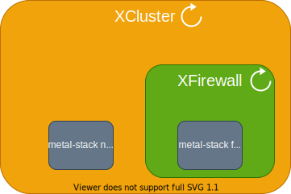

# Use Kubebuilder to Write a Controller on Top of Metal-stack
COMMENT: what will be the actual blog title?

Along the way of implementing [*cluster-api*](https://github.com/kubernetes-sigs/cluster-api) on top of [*metal-stack*](https://github.com/metal-stack) we learnt something about [*kubebuilder*](https://github.com/kubernetes-sigs/kubebuilder)  which enables us to write reconcilation logic easily and we want to share that knowledge with you, so we built this project, an extremely simplified version of cluster which contains *metal-stack* resources. We will assume you already went through [*kubebuiler book*](https://book.kubebuilder.io) and are looking for more hands-on examples. By referencing the code in this project, you should be able to create a *CustomResourceDefinition* (CRD), write its reconciliation logic and deploy it.

COMMENT: what is a "minimal computer cluster"? perhaps a short introduction for what kind of "example controller" we are building here would be nice. What is the overall goal of this exercise? The introductory sentence should be understandable by readers who don't know kubebuilder, too. this way, readers can better decide what this article is about and if they want to continue reading. maybe, try to outline the structure of this article, too: what will we do first, what will we do in the end?

## Architecture

We created two *CRD*, `XCluster` and `XFirewall`, as shown in the following figure. `XCluster` represents the computer cluster which contains *metal-stack network* and `XFirewall`. `XFirewall` corresponds to *metal-stack firewall*. The circular arrows imply the nature of reconciliation and also the corresponding [*controllers*](https://github.com/LimKianAn/xcluster/tree/main/controllers) which reconcile the states of the resources.



## metal-api

[*metal-api*](https://github.com/metal-stack/metal-api) manages all *metal-stack* resources, including machine, firewall, switch, OS image, IP, network and more. They are constructs which enable you to turn your data center into elastic cloud infrastructure. You can try it out on *mini-lab*, where we built this demo project. In this project, *metal-api* does the real job. It allocates the network and creates the firewall, fulfilling what you wish in the [**xcluster.yaml**](https://github.com/LimKianAn/xcluster/blob/main/config/samples/xcluster.yaml).

## Demo

Clone the repo of [*mini-lab*](https://github.com/metal-stack/mini-lab) and *xcluster* in the same folder. *mini-lab* is a local development platform, on which you can play with *metal-stack* resources.

```console
├── mini-lab
└── xcluster
```

COMMENT: explain mini-lab briefly, most of the people will not know what it is.

Download the prerequisites of [*mini-lab*](https://github.com/metal-stack/mini-lab#requirements). Then,

```bash
cd mini-lab
make
```

It's going to take some time to finish. Behind the scene, a [kind](https://github.com/kubernetes-sigs/kind/) cluster is created, *metal-api* related kubernetes resources are deployed, and multiple *linux kernel-based virtual machines* are created for *metal-stack* switches and machines. 

From time to time, do

```bash
docker-compose run metalctl machine ls
```

COMMENT: explain what happens in the background now?

Till you see **Waiting** under **LAST EVENT** as follows:

```console
ID                                          LAST EVENT   WHEN     AGE  HOSTNAME  PROJECT  SIZE          IMAGE  PARTITION
e0ab02d2-27cd-5a5e-8efc-080ba80cf258        Waiting      8s                               v1-small-x86         vagrant
2294c949-88f6-5390-8154-fa53d93a3313        Waiting      8s                               v1-small-x86         vagrant
```

Then, in another terminal yet still in folder *mini-lab* (must!), do

``` bash
eval $(make dev-env) # for talking to metal-api in this shell
cd ../xcluster
```

Now you should be in folder *xcluster*. Then,

```bash
make
```

Behind the scene, all related kubernetes resources are deployed:
- *CRD*s of `XCluster` and `XFirewall`
- *xcluster-controller-manager* `Deployment` which manages two controllers with the reconciliation logic of yours inside
- `ClusterRole` and `ClusterRoleBinding` which entitile your manager to manage the resources `XCluster` and `XFirewall`.

Then, check out your *xcluster-controller-manager* running alongside other *metal-stack* deployments.

```bash
kubectl get deployment -A
```

Then, deploy your *xcluster*.

```bash
kubectl apply -f config/samples/xcluster.yaml
```

Check out your brand new *custom resources*.

```bash
kubectl get xcluster,xfirewall -A
```

The results should read:
```bash
NAME                                           READY
xcluster.cluster.www.x-cellent.com/x-cellent   true

NAME                                            READY
xfirewall.cluster.www.x-cellent.com/x-cellent   true
```

COMMENT: maybe console output would also be nice such that a reader knows he's seeing the same things you do and to make sure he's still on the right track

Then go back to the previous terminal where you did

```bash
docker-compose run metalctl machine ls
```

Repeat the command and you should see a *metal-stack* firewall running. 

```bash
ID                                                      LAST EVENT      WHEN    AGE     HOSTNAME                PROJECT                                 SIZE            IMAGE                          PARTITION 
e0ab02d2-27cd-5a5e-8efc-080ba80cf258                    Waiting         41s                                                                             v1-small-x86                                   vagrant  
2294c949-88f6-5390-8154-fa53d93a3313                    Phoned Home     21s     14m 19s x-cellent-firewall      00000000-0000-0000-0000-000000000000    v1-small-x86    Firewall 2 Ubuntu 20201126     vagrant  
```

The reconciliation logic in reconcilers did their job to deliver what's in the sample [manifest](https://github.com/LimKianAn/xcluster/blob/main/config/samples/xcluster.yaml). This manifest is the only thing the user has to worry about.

COMMENT: maybe summarize what was happening, maybe be a bit more enthusiastic about the end result? 😅

## kubebuilder markers for CRD

COMMENT: what is a marker? haven't read the kubebuilder book which could be a problem for me now, but at least a link to the docs would be nice

*kubebuilder* provides lots of handful [markers](https://book.kubebuilder.io/reference/markers.html). Here are some examples:

1. API Resource Type

   ``` go
   // +kubebuilder:object:root=true
   ```

   The *go* `struct` under this marker will be an *API resource type* in the url. For example, the url path to `XCluster` instance *myxcluster* would be

   ```url
   /apis/cluster.www.x-cellent.com/v1/namespaces/myns/xclusters/myxcluster
   ```

1. API Subresource

   ```go
   // +kubebuilder:subresource:status
   ```

   The *go* `struct` under this marker contains *API subresource* status. For the last example, the url path to the status of the instance would be:

   ```url
   /apis/cluster.www.x-cellent.com/v1/namespaces/myns/xclusters/myxcluster/status
   ```

1. Terminal Output

   ```go
   // +kubebuilder:printcolumn:name="Ready",type=string,JSONPath=`.status.ready`
   ```

   This specifies an extra column of output on terminal when you do `kubectl get`.


## Wire up metal-api client metalgo.Driver

`metalgo.Driver` is the client in *go* code for talking to *metal-api*. To enable both controllers of `XCluster` and `XFirewall` to do that, we created a `metalgo.Driver` named `metalClient` and set field `Driver` of both controllers as shown in the following snippet from [**main.go**](https://github.com/LimKianAn/xcluster/blob/main/main.go).

```go
	if err = (&controllers.XClusterReconciler{
		Client: mgr.GetClient(),
		Driver: metalClient,
		Log:    ctrl.Log.WithName("controllers").WithName("XCluster"),
		Scheme: mgr.GetScheme(),
	}).SetupWithManager(mgr); err != nil {
		setupLog.Error(err, "unable to create controller", "controller", "XCluster")
		os.Exit(1)
	}
```

## Role-based access control (RBAC)

With the following lines in [**xcluster_controller.go**](https://github.com/LimKianAn/xcluster/blob/main/controllers/xcluster_controller.go) and the equivalent lines in [**xfirewall_controller.go**](https://github.com/LimKianAn/xcluster/blob/main/controllers/xfirewall_controller.go) (in our case overlapped), *kubebuiler* generates [**role.yaml**](https://github.com/LimKianAn/xcluster/blob/main/config/rbac/role.yaml) and wire up everything for your *xcluster-controller-manager* pod when you do `make deploy`. The `verbs` are the actions your pod is allowed to perform on the `resources`, which are `xclusters` and `xfirewalls` in our case.

```go
// +kubebuilder:rbac:groups=cluster.www.x-cellent.com,resources=xclusters,verbs=get;list;watch;create;update;patch;delete
// +kubebuilder:rbac:groups=cluster.www.x-cellent.com,resources=xclusters/status,verbs=get;update;patch
// +kubebuilder:rbac:groups=cluster.www.x-cellent.com,resources=xfirewalls,verbs=get;list;watch;create;update;patch;delete
// +kubebuilder:rbac:groups=cluster.www.x-cellent.com,resources=xfirewalls/status,verbs=get;update;patch
```

## Finalizer

When you want to do some clean-up before the kubernetes *api-server* deletes your resource in no time upon `kubectl delete`, *finalizers* comes in handy. A *finalizer* is simply a string constant stored in the `finalizers` field of a Kubernetes object's metadata. For example, the *finalizer* of `XCluster` in [**xcluster_types.go**](https://github.com/LimKianAn/xcluster/blob/main/api/v1/xcluster_types.go):

`const XClusterFinalizer = "xcluster.finalizers.cluster.www.x-cellent.com"`

The *api-server* will not delete the instance before its *finalizer*s are all removed from the resource instance. For example, in [**xcluster_controller.go**](https://github.com/LimKianAn/xcluster/blob/main/controllers/xcluster_controller.go) we add the above finalizer to the `XCluster` instance, so later when the instance is about to be deleted, the *api-server* can't delete the instance before we've freed the *metal-stack* network and then removed the finalizer from the instance. We can see that in action in the following listing. We use the `Driver` mentioned earlier to ask *metal-api* if the *metal-stack network* we allocated is still there. If so, we use the `Driver` to free it and then remove teh *finalizer* of `XCluster`. 

```go
	resp, err := r.Driver.NetworkFind(&metalgo.NetworkFindRequest{
		ID:        &cl.Spec.PrivateNetworkID,
		Name:      &cl.Spec.Partition,
		ProjectID: &cl.Spec.ProjectID,
	})

	if err != nil {
		return ctrl.Result{}, fmt.Errorf("failed to list metal-stack networks: %w", err)
	}

	if len := len(resp.Networks); len > 1 {
		return ctrl.Result{}, fmt.Errorf("more than one network listed: %w", err)
	} else if len == 1 {
		if _, err := r.Driver.NetworkFree(cl.Spec.PrivateNetworkID); err != nil {
			return ctrl.Result{Requeue: true}, nil
		}
	}
	log.Info("metal-stack network freed")

	cl.RemoveFinalizer(clusterv1.XFirewallFinalizer)
	if err := r.Update(ctx, cl); err != nil {
		return ctrl.Result{}, fmt.Errorf("failed to remove xcluster finalizer: %w", err)
	}
	r.Log.Info("finalizer removed")
```

Likewise, in [**xfirewall_controller.go**](https://github.com/LimKianAn/xcluster/blob/main/controllers/xfirewall_controller.go) we add the finalizer to `XFirewall` instance. Likewise, the *api-server* can't delete the instance before we clean up the underlying *metal-stack* firewall (`r.Driver.MachineDelete(fw.Spec.MachineID)` in the following listing) and then remove the finalizer from the instance:

```go
func (r *XFirewallReconciler) DeleteFirewall(ctx context.Context, fw *clusterv1.XFirewall, log logr.Logger) (ctrl.Result, error) {
	if _, err := r.Driver.MachineDelete(fw.Spec.MachineID); err != nil {
		return ctrl.Result{}, fmt.Errorf("failed to delete firewall: %w", err)
	}
	log.Info("states of the machine managed by XFirewall reset")

	fw.RemoveFinalizer(clusterv1.XFirewallFinalizer)
	if err := r.Update(ctx, fw); err != nil {
		return ctrl.Result{}, fmt.Errorf("failed to remove XFirewall finalizer: %w", err)
	}
	r.Log.Info("finalizer removed")

	return ctrl.Result{}, nil
}
```

## func errors.IsNotFound and client.IgnoreNotFound

When you have different handlers depending on whether the error is **the instance not found**, you can consider using `errors.IsNotFound(err)` as follows from **xcluster_controller.go**:

```go
	fw := &clusterv1.XFirewall{}
	if err := r.Get(ctx, req.NamespacedName, fw); err != nil {
		// errors other than `NotFound`
		if !errors.IsNotFound(err) {
			return ctrl.Result{}, fmt.Errorf("failed to fetch XFirewall instance: %w", err)
		}

		// Create XFirewall instance
		fw = cl.ToXFirewall()
```

If we can do nothing against the error **the instance not found**, we might simply stop the reconciliation without requeueing the request as follows:

```go
	cl := &clusterv1.XCluster{}
	if err := r.Get(ctx, req.NamespacedName, cl); err != nil {
		return ctrl.Result{}, client.IgnoreNotFound(err)
	}
```

## Exponential Back-Off

As far as requeue is concerned, returning `ctrl.Result{}, err` and `ctrl.Result{Requeue: true}, nil` are the same as shown in this [`if`](https://github.com/kubernetes-sigs/controller-runtime/blob/0fcf28efebc9a977c954f00d40af966d6a4aeae3/pkg/internal/controller/controller.go#L256) clause and this [`else if`](https://github.com/kubernetes-sigs/controller-runtime/blob/0fcf28efebc9a977c954f00d40af966d6a4aeae3/pkg/internal/controller/controller.go#L271) clause in the source code. Moreover, exponential back-off can be observed in the source code where dependencies of [controller](https://github.com/kubernetes-sigs/controller-runtime/blob/v0.5.0/pkg/controller/controller.go#L90) are set and where [`func workqueue.DefaultControllerRateLimiter`](https://github.com/kubernetes/client-go/blob/0b19784585bd0a0ee5509855829ead81feaa2bdc/util/workqueue/default_rate_limiters.go#L39) is defined.

## ControllerReference

ControllerReference is a kind of `OwnerReference` that enables the garbage collection of the owned instance (`XFirewall`) when the owner instance (`XCluster`) is deleted. We demonstrate that in **xcluster_controller.go** by using the function `SetControllerReference`.

```go
		if err := controllerutil.SetControllerReference(cl, fw, r.Scheme); err != nil {
			return ctrl.Result{}, fmt.Errorf("failed to set the owner reference of the XFirewall: %w", err)
		}
```

Since `XCluster` owns `XFirewall` instance, we have to inform the manager that it should reconciling `XCluster` upon any change of an `XFirewall` instance:

```go
func (r *XClusterReconciler) SetupWithManager(mgr ctrl.Manager) error {
	return ctrl.NewControllerManagedBy(mgr).
		For(&clusterv1.XCluster{}).
		Owns(&clusterv1.XFirewall{}).
		Complete(r)
}
```

## Wrap-up

Check out the code in this project for more details. If you want a fully-fledged implementation, stay tuned! Our *cluster-api-provider-metalstack* is on the way. If you want more blog posts about *metal-stack* and *kubebuilder*, let us know! Special thanks go to [*Grigoriy Mikhalkin*](https://github.com/GrigoriyMikhalkin).

COMMENT: to me it feels like the explanations could be a bit more general and then point the reader to specific code examples, most of the readers will not know metal-stack very well.
Reply: I still keep the part of `metal-stack` in it and added some descriptions..
